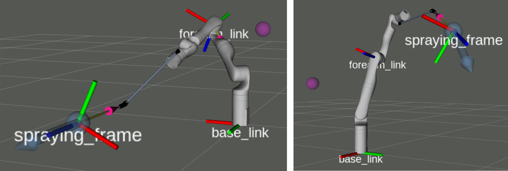

# Prioritized Inverse Kinematics ROS
[](https://github.com/ivatavuk/pik_ros/actions/workflows/noetic.yml)

Prioritized Inverse Kinematics ROS library `pik_ros`.

The PIK solver gives a solution to the prioritized positional inverse kinematics problem: selecting joint positions that result in optimizing a number of prioritized tasks for different links in the kinematic chain.

In the image bellow you can see examples with following priorities:

 - `spraying_frame` position, shown with a blue sphere
 - `spraying_frame` approach axis orientation, shown with a blue arrow 
 - `forearm_link` position, shown with a purple sphere



PIK ROS solver uses sequential prioritized optimization, where [`PtscEigen`](https://github.com/ivatavuk/ptsc_eigen) is used for prioritized optimization, and [`MoveIt`](https://moveit.ros.org/) is used for the robot model data and Jacobian calculation. 

## 🖥️ Using the library

### ⚙️ Dependencies

This project depends on [`ROS`](https://www.ros.org/), [`MoveIt`](https://moveit.ros.org/) and [`PtscEigen`](https://github.com/ivatavuk/ptsc_eigen).

### ⚙️ Build

Clone to your catkin workspace and build with 

    catkin build pik_ros

### Usage example

```cpp
//Include the library header 
#include <PikRos.hpp>

//Construct the Pik object 
PikRos::Pik my_pik( nh,                           //ros node handle
                    "my_robot_name",              //namespace for robot description
                    "my_joint_model_group_name",  //for MoveIt
                    settings);                    //PikRos::Settings object

//Define a vector of tasks, with descending priorities 
//IkTask constructor takes arguments: (task_type, frame, desired_value)
std::vector<PikRos::IkTask> ik_tasks{ 
  PikRos::IkTask( PikRos::FRAME_POSITION, "spraying_frame", desired_tool_position ), 
  PikRos::IkTask( PikRos::FRAME_APPROACH_AXIS, "spraying_frame", desired_approach_vector ),
  PikRos::IkTask( PikRos::FRAME_POSITION, "forearm_link", desired_elbow_position ) 
};

// Solve problem
Eigen::VectorXd q = my_pik.solve( ik_tasks, q_initial_guess );
```

### Including the library in your ROS project

Find the `pik_ros` pacakage in your CMakeLists.txt file:
```cmake
find_package( catkin REQUIRED COMPONENTS 
              pik_ros 
              ... )
```

And link the catkin libraries:
```cmake
target_link_libraries( your_target_name 
                       ${catkin_LIBRARIES}
                       ... )
```

For a complete usage example see [`kinova_gen3_pik_examples`](https://github.com/ivatavuk/kinova_gen3_pik_examples)

### Available Tasks
Priorities are given to the solver as a vector of PikRos::IkTask objects, with descending priorities.

PikRos::IkTaskType describes a particular task type given to the solver. Available task types are:

 - `FRAME_POSITION` - Frame position task, has a value of [x, y, z]^T in meters
 - `FRAME_ORIENTATION` - Frame orientation task, has a quaternion value [w, x, y, z]^T
 - `FRAME_POSE` - Frame pose task, a combination of FRAME_POSITION and FRAME_ORIENTATION tasks
 - `FRAME_APPROACH_AXIS` - Frame approach axis task, has a value of a 3D vector [x, y, z]^T

## Citing 

TODO

## 📝 License

Materials in this repository are distributed under the following license:

> All software is licensed under the BSD 3-Clause License.
